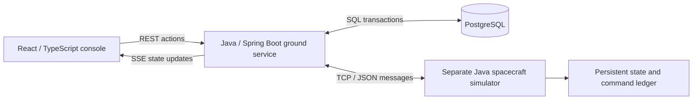

# Apogee · Spacecraft Ground Control

A Java ground-control simulator for planning procedures, commanding a simulated spacecraft, and verifying what happened when communication fails.

**Requested ≠ accepted ≠ completed.** A spacecraft can finish an observation even when its completion acknowledgment never reaches the ground. Apogee records that uncertainty, queries the spacecraft's saved command history, and lets the operator resume with evidence.


## Run locally

Requires Docker with Compose. No cloud account, API key, or spacecraft hardware is needed.

```sh
git clone https://github.com/Da0t/apogee-ground-control.git
cd apogee-ground-control
./scripts/compose.sh up --build -d
```

Open [Apogee on localhost:8081](http://127.0.0.1:8081). The first build downloads dependencies; the built app serves its interface, fonts, and map outlines locally. Repository access is required to clone a private copy.

On macOS with Colima, start Colima first. The helper supports both `docker compose` and Homebrew's `docker-compose`.

```sh
./scripts/compose.sh logs -f ground simulator
./scripts/compose.sh stop   # keeps the database and spacecraft ledger
./scripts/compose.sh start
```

## Try the recovery demo

Start with continuous contact, no active or pending runs, and **Nominal conditions** applied.

1. On **Mission console**, select **Observation procedure · v1** and execute it. The three steps complete in roughly 12 seconds.
2. Apply **Lost completion acknowledgment** and execute another observation.
3. Wait for the collection command to become **UNKNOWN** and the procedure to pause.
4. Click **Reconcile spacecraft state**, wait for the command to show **COMPLETED**, then click **Resume**.
5. Open **Run history** to inspect the decisions and export the run.

The observation is recorded once: reconciliation asks for the existing command's result. For the full walkthrough, contact-loss demo, and recovery controls, see the [operator guide](docs/OPERATING.md).

## Explore the workspace

| Page                               | What you can do                                                                                                          |
| ---------------------------------- | ------------------------------------------------------------------------------------------------------------------------ |
| **Mission console** · `/console`   | Monitor telemetry, execute a saved procedure, inject failures, and reconcile uncertain outcomes.                         |
| **Procedures** · `/procedures`     | Publish immutable versions with 2–8 typed steps, execution durations, verification timeouts, and telemetry requirements. |
| **Contact planning** · `/contacts` | Rotate the globe, configure simulated communication windows, and schedule runs.                                          |
| **Run history** · `/history`       | Replay recorded decisions and export the procedure definition, commands, and events.                                     |

Each page supports direct loading, refresh, and browser navigation. [Preview contact planning](docs/contacts.png) or the [procedure editor](docs/procedures.png).

## How it fits together



Docker runs three services: ground, simulator, and database. The browser runs React; Spring Boot serves the built frontend and API. Button actions use REST, and live browser updates use server-sent events (SSE).

**Stack:** Java 21, Spring Boot 3.5.16, JDBC, Flyway, PostgreSQL 17, React, TypeScript, Vite, Docker Compose, JUnit, Testcontainers, and Playwright.

## Documentation

| Start here when you want to…                          | Guide                                                   |
| ----------------------------------------------------- | ------------------------------------------------------- |
| Understand the buttons and run a demonstration        | [Operate Apogee](docs/OPERATING.md)                     |
| Trace a click through the code and learn the design   | [Code walkthrough and learning guide](docs/LEARNING.md) |
| Review state, persistence, concurrency, and tradeoffs | [Architecture](docs/ARCHITECTURE.md)                    |
| Look up HTTP endpoints and TCP messages               | [API and protocol reference](docs/PROTOCOL.md)          |
| Build, run, and troubleshoot the project              | [Local development](docs/DEVELOPMENT.md)                |
| Check requirements and test evidence                  | [Verification](docs/VERIFICATION.md)                    |
| Review the optional cloud setup                       | [AWS deployment guide](infra/aws/README.md)             |

## Scope and verification

The TCP connection, database transactions, process separation, timeouts, and recovery behavior are real software. Battery, storage, instrument behavior, observations, and contact timing are illustrative models. Collection increments an observation count and saves completion evidence in the simulator ledger; it generates no image pixels.

The globe uses bundled [Natural Earth outlines](web/NOTICE.md) and a synthetic surface track. Contact windows are configured by time; station coordinates do not calculate radio visibility. This project makes no orbital-accuracy, flight-software, or CCSDS/XTCE compliance claim.

The suite contains **32 Java tests and six browser scenarios**. [GitHub Actions](https://github.com/Da0t/apogee-ground-control/actions/workflows/verify.yml) provides results for each commit. See [verification](docs/VERIFICATION.md) for coverage and [architecture limits](docs/ARCHITECTURE.md#limits) for the current boundaries.

The default deployment is local, with one ground service and one spacecraft. Public login/authorization is not implemented. The optional AWS files have been prepared and checked locally; no AWS resources have been provisioned as part of this project setup.

## Design references

- [Yamcs commanding](https://docs.yamcs.org/yamcs-server-manual/tc/) and [command verification](https://docs.yamcs.org/yamcs-server-manual/mdb/loaders/sheet/command-verification/).
- [Lockheed Martin satellite software](https://www.lockheedmartin.com/en-us/products/satellite-software.html).

These are design references, with no affiliation or compatibility claim. The project's contribution is reliable procedure execution and evidence-based recovery in Java.
