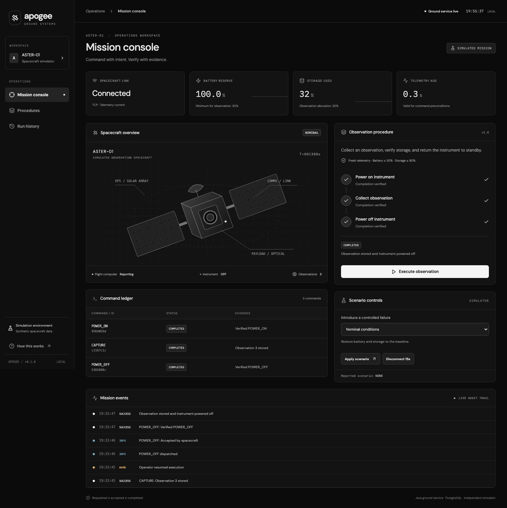
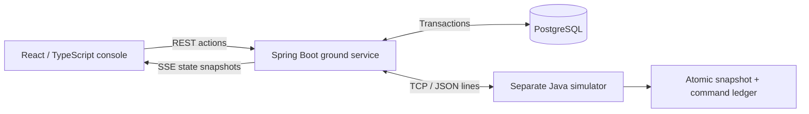

# Apogee · Spacecraft Ground Control

A Java ground-control simulator for executing an observation procedure, monitoring synthetic spacecraft telemetry, and reconciling command outcomes after communication failures.

**Requested ≠ accepted ≠ completed.** An acknowledgment can disappear after the spacecraft has executed an action. Apogee preserves that uncertainty, queries the spacecraft's durable command ledger, and lets the operator decide when to resume.



## Run

Requirements: Docker with Compose. No cloud account, API key, or hardware is required. The first build downloads dependencies; the built application runs locally, including its fonts.

```sh
git clone https://github.com/Da0t/apogee-ground-control.git
cd apogee-ground-control
./scripts/compose.sh up --build -d
```

Open **http://127.0.0.1:8081**. The existing mission scheduler, if running on 8080, is independent.

```sh
./scripts/compose.sh logs -f ground simulator
./scripts/compose.sh stop       # preserves database and spacecraft ledger
./scripts/compose.sh start
```

On macOS with Colima, run `colima start` first. `scripts/compose.sh` supports both `docker compose` and Homebrew's `docker-compose` command.

## The two-minute demo

1. Wait for **Ground service live**, a connected spacecraft link, and fresh telemetry.
2. Execute an observation. Power-on, collection, and power-off complete in approximately 12 seconds.
3. Apply **Lost completion acknowledgment**, then execute another observation.
4. The spacecraft stores the observation, but suppresses its final collection acknowledgment. After the 12-second verification window, the procedure pauses and the command becomes **UNKNOWN**.
5. Click **Reconcile spacecraft state**. Apogee queries the simulator ledger; it does not repeat the observation.
6. Click **Resume** to execute the remaining power-off step.
7. Open **Run history**, inspect the event sequence, and export the run as JSON.

Apply **Nominal conditions** between experiments to clear faults and restore illustrative battery/storage values. This is a simulator control, not a flight command; it does not erase history or cancel in-flight commands. Replay is an inspection of recorded events, not a physics replay or re-execution.

Other scenarios: low battery, frozen telemetry, instrument rejection, and a 15-second connection interruption. To demonstrate process recovery, restart only the ground service during collection: `./scripts/compose.sh restart ground`. The simulator continues independently; recovered in-flight commands become UNKNOWN and require reconciliation.

## What is real and what is simulated?

| Real software behavior | Illustrative model |
| --- | --- |
| Two independent Java processes exchanging framed messages over TCP | Battery starts at 82%; standby adds 0.04 percentage points/tick, active instrument uses 0.08/tick |
| PostgreSQL transactions, schema migration, persisted run/command/event records | Observation takes six 1-second ticks and consumes 20 percentage points of storage |
| Timeouts, disconnects, duplicate IDs, process restarts and status reconciliation | Instrument states OFF / READY / COLLECTING; no image pixels or physical payload |
| React console receiving server-sent events | Solar panels and spacecraft drawing are an explanatory schematic |

This is educational **ground software with a simulated spacecraft**, not flight software, real satellite telemetry, or a certified operating system. No CCSDS or XTCE compliance is claimed.

## Architecture



- Java 21 target; Spring Boot 3.5.16; JDBC, Flyway and PostgreSQL 17.
- React/TypeScript/Vite; all application and font assets served by Spring Boot.
- A plain-Java domain engine accepts a clock, store and link interface. It does not depend on Spring.
- A procedure v1 contains three typed commands. One active run reserves the instrument, including while paused or aborting.
- Command intent and execution history are committed before a socket send. The network and database are not assumed to share a transaction.
- Completed commands cannot regress when a late acceptance message arrives. UNKNOWN is not automatically retried.

Details: [Architecture and decisions](docs/ARCHITECTURE.md), [Protocol](docs/PROTOCOL.md), [Requirements and verification](docs/VERIFICATION.md), [Learning guide](docs/LEARNING.md).

## Development

Optional cloud setup: [AWS deployment guide](infra/aws/README.md) describes private RDS PostgreSQL, a Java 21 host and authenticated console access through Session Manager. The deployment files are prepared and checked locally; no AWS resources have been provisioned or cloud behavior verified. Docker remains the default development setup.

Local tools: JDK 21+, Node 22.12+ and Docker. Maven is provided by the wrapper. The container/CI build uses Java 21.

```sh
./scripts/compose.sh up -d database
./scripts/build.sh
# Separate terminals:
java -jar target/apogee-0.1.0.jar --simulator
java -jar target/apogee-0.1.0.jar
```

For frontend hot reload: `cd web && npm run dev` (API proxy to port 8081). Container and local simulator state are separate: a named Docker volume versus `data/spacecraft.json`.

```sh
./mvnw verify                  # includes real PostgreSQL Testcontainers tests
cd web
npm ci
npx playwright install chromium
npm run test:e2e               # requires a running stack with no active procedure
```

To exercise a forced backend crash against the Docker Compose stack, run `python3 scripts/check-restart.py` from the project root. It creates an observation and kills/restarts the ground container during collection, then checks recovery without a duplicate observation. It refuses to interrupt an already active procedure.

With Colima, Java Testcontainers may need:

```sh
export DOCKER_HOST="unix://$HOME/.colima/default/docker.sock"
export TESTCONTAINERS_DOCKER_SOCKET_OVERRIDE=/var/run/docker.sock
```

Tests fail if Docker is unavailable; database tests are not silently skipped. GitHub Actions runs Java tests on Java 21 and browser scenarios on Linux. Browser tests alter the local simulator and create run history; use a separate Compose project/ports if preserving a demonstration dataset.

## Boundaries

- One ground-service instance, one spacecraft and one fixed procedure version. No distributed leader election or arbitrary script execution.
- Localhost-only published ports and cross-origin browser mutation rejection. No user authentication/RBAC; do not expose it to a public network.
- Recent console history: 100 runs and 250 events; individual runs remain addressable by UUID. Telemetry retains approximately one hour; charts show the latest 90 samples. Run/command/event records are not automatically deleted.
- The simulator ledger retains at most 10,000 command IDs. Duplicate suppression holds while its snapshot survives. It is not an unconditional exactly-once guarantee.
- Snapshot writes support ordinary process-restart recovery. No claim is made about power-loss durability across all filesystems or disk failure.
- Abort does not undo an executed command or automatically power off an instrument. Unresolved in-flight outcomes retain the reservation until reconciled.
- The current model has no orbit propagation, real downlink image pipeline, thermal model, or autonomous safe-mode recovery. These are optional future work, not implemented features.

## Why this project

The portfolio progression is operator telemetry → distributed communication → reliable procedure execution in Java. The distinct contribution here is command verification and persistence under uncertain outcomes.

Design references, not code dependencies or affiliations:
- [Yamcs commanding](https://docs.yamcs.org/yamcs-server-manual/tc/) and [verification](https://docs.yamcs.org/yamcs-server-manual/mdb/loaders/sheet/command-verification/).
- [Lockheed Martin ground software](https://www.lockheedmartin.com/en-us/products/satellite-software.html).

See [project scope and résumé framing](docs/LEARNING.md). Describe only demonstrated capabilities and measured results in interviews.
