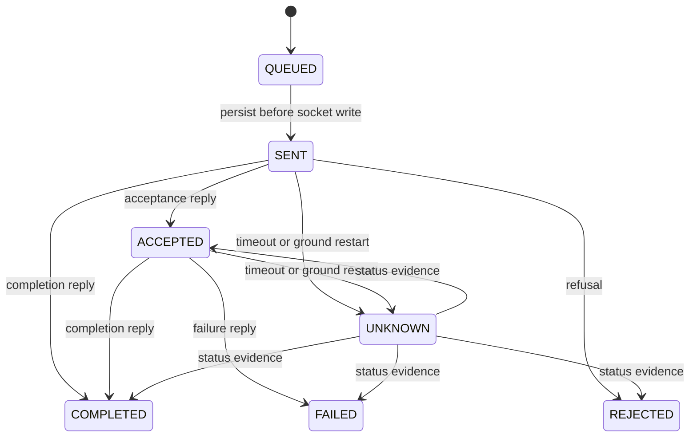

# Architecture and decisions

[Project overview](../README.md) · [Code walkthrough](LEARNING.md) · [Protocol](PROTOCOL.md) · [Verification](VERIFICATION.md)

Apogee has one authoritative ground engine and one independent spacecraft model. They communicate over TCP and persist their own state. A browser observes ground-side evidence and requests operator actions.

## Runtime and ownership

| Component            | Owns                                                                                                  | Persistence                                              |
| -------------------- | ----------------------------------------------------------------------------------------------------- | -------------------------------------------------------- |
| React frontend       | Draft form values, navigation, replay cursor, and displayed snapshots                                 | No authoritative mission state in the browser.           |
| Ground service       | Run lifecycle, procedure selection, dispatch decisions, contact policy, and verified command outcomes | PostgreSQL through `MissionStore` / `PostgresStore`.     |
| Spacecraft simulator | Instrument state, illustrative resources, accepted work, and executed outcomes                        | Atomically replaced JSON snapshot with a command ledger. |

Closing the browser does not stop an execution. Disconnecting the ground link does not stop work accepted by the spacecraft. On simulator restart, ticks resume from the saved snapshot without fast-forwarding through downtime.

The model is deterministic for the same initial snapshot and ordered command/fault/tick inputs. Battery starts at 82% and storage at 12%. Each tick adds 0.04 battery percentage points while the instrument is off or subtracts 0.08 while powered, clamped to 0–100%. A completed collection adds one observation and 20 storage percentage points. These values are illustrative resource rules.

## Ground engine and transactions

`GroundEngine` uses synchronized methods to serialize API actions, incoming TCP messages, and timer updates. `MissionApi` calls its progress check with a 250 ms fixed delay. Each check advances at most one procedure step. SSE sends happen after snapshot creation, outside the engine lock.

`MissionStore` defines the persistence interface. `PostgresStore` combines relational IDs/status columns with JSONB documents. `TransactionTemplate` commits related state and event updates together. A partial unique index permits one active instrument reservation, including paused and aborting runs.

This is a single-ground-process design. The database constraint alone is not a distributed dispatch lock.

## Command lifecycle

The usual path is `QUEUED → SENT → ACCEPTED → COMPLETED`. Completion can arrive before acceptance. The engine preserves terminal outcomes when late messages arrive.

`SENT` records a dispatch attempt or intent immediately before transmission. It does not prove receipt. The database commit and socket write cannot be one atomic operation; a crash between them is recovered conservatively as `UNKNOWN`.

A missing outcome pauses the procedure. Reconciliation queries the existing command ID and updates evidence; the operator explicitly resumes. A `NOT_FOUND` response cannot establish whether the command never arrived or the spacecraft lost its ledger, so it preserves uncertainty. Unresolved work keeps its reservation. Automatic recovery from lost ledger data is outside the current implementation.

Onboard, resource changes and command completion are saved in the same snapshot before a completion reply is sent. Saving uses an fsynced temporary file and atomic rename. Duplicate IDs return recorded status; reusing an ID with a different kind or duration is rejected. These guarantees depend on retaining the snapshot and do not cover arbitrary hardware/storage loss.

## Procedures and scheduling

Published definitions use immutable `(id, version)` keys. A caller supplies its base version so publication can reject a stale edit. Each run copies the definition at creation, including for future schedules. A later publication cannot alter that run.

Definitions contain 2–8 typed commands with ordered power transitions, a final powered-off state, execution durations, verification timeouts, and applicable telemetry requirements. Validation permits stronger-than-minimum requirements and executes no user-supplied code.

Scheduled runs acquire no instrument reservation until activation. Each engine check first expires missed start deadlines, then considers pending runs in earliest-start, creation-time, and ID order. At most one eligible run activates, requiring an available instrument, permitted contact, a live link, fresh telemetry, and the first step's requirements. Requirements are checked again before every dispatch.

| Time setting             | Controls                                                                                          |
| ------------------------ | ------------------------------------------------------------------------------------------------- |
| Step duration            | How many one-second simulation ticks execution takes.                                             |
| Verification timeout     | How long the ground waits for command evidence; acceptance restarts the timeout from its receipt. |
| Scheduled earliest start | When a pending run first becomes eligible.                                                        |
| Scheduled start deadline | Latest time it may begin; already-running work is not cancelled by this deadline.                 |
| Contact window           | When the ground link is permitted to connect and communicate.                                     |

## Contacts, networking, and clocks

A persisted contact plan defines an epoch, cycle period, and open duration. Window starts are inclusive and ends exclusive. The engine updates the TCP adapter during its periodic check, checks the window again before dispatch, and ignores incoming messages outside contact. The adapter closes its socket during a blackout and pauses reconnects. Accepted spacecraft work continues independently.

Reopening contact permits connection recovery; paused runs retain explicit reconciliation/resume behavior. Continuous contact can be restored to recover an active run.

TCP carries bounded, newline-delimited JSON messages. The lost-completion scenario suppresses an application reply before it is written to TCP. It does not emulate arbitrary loss of bytes already delivered by TCP. Reconnection never automatically resends mission commands.

Telemetry is timestamped on receipt. Duplicate or reversed sequence numbers within the same simulator boot are ignored; a new boot ID identifies a new session. Freshness measures elapsed time since receipt of a new message, not the physical age of a sensor reading. The engine uses an injected clock for tests and wall-clock milliseconds live; large host-clock adjustments can affect deadlines.

## Browser updates and visuals

REST accepts actions. SSE sends a full state snapshot about once a second, simplifying browser reconnection. The browser marks data unavailable when its stream drops; stale values cannot enable execution. Full snapshots are a deliberate small-demo choice, not a throughput benchmark.

Four page URLs serve the same React application through explicit Spring routes. Event replay displays recorded decisions and sends no spacecraft commands.

The satellite drawing is a subsystem schematic. The globe projects bundled [Natural Earth outlines](../web/NOTICE.md) and a synthetic great-circle surface track using the saved contact cycle's phase. Station coordinates affect the illustration; neither orbital elements nor an RF visibility model determine contact.

## Limits

| Area              | Current boundary                                                                                                                                                              |
| ----------------- | ----------------------------------------------------------------------------------------------------------------------------------------------------------------------------- |
| Deployment        | One ground instance and one spacecraft; localhost access with cross-site browser mutation rejection, no user authentication/RBAC.                                             |
| Procedures        | Linear typed steps, no arbitrary scripts, branching, or distributed leader election.                                                                                          |
| Scheduling        | At most 50 pending runs. API earliest start is within seven days; start deadline is at most 24 hours after earliest start. The UI's start-delay input is limited to one hour. |
| History           | Recent state exposes 100 runs, up to 300 stored procedure versions plus the built-in v1 fallback when absent, and 250 events. Individual runs remain addressable by UUID.     |
| Telemetry         | Roughly 3,600 recent received samples are retained; charts use the latest 90. This approximates one hour only while samples arrive each second.                               |
| Export            | Run, commands, and up to 250 events; run/command/event records are not automatically deleted.                                                                                 |
| Spacecraft ledger | At most 10,000 command IDs. Duplicate suppression depends on preserving the snapshot.                                                                                         |
| Abort             | Stops future steps; does not undo effects or automatically power off. Unresolved outcomes retain the reservation.                                                             |
| Physical model    | Illustrative telemetry and observations; no image pipeline, orbital propagation, RF visibility, thermal model, or autonomous safe-mode recovery.                              |

## Possible extensions

Further work could add telemetry alarm lifecycles, bounded asynchronous socket writes, stronger clock modeling, a replicated spacecraft ledger, user authorization, or physically derived contact windows. These are future possibilities, not implemented capabilities. The original mission-scheduler repository remains independent.
