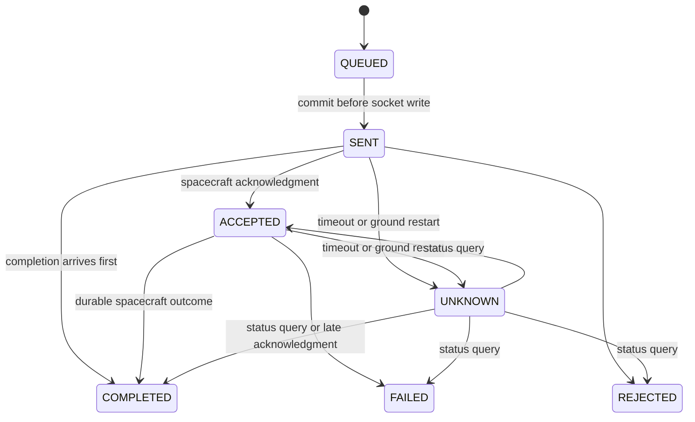

# Architecture and decisions

## Ground service

`GroundEngine` is a synchronized single-writer controller. Its 250 ms pump advances at most one procedure step per call. API operations and inbound TCP messages use the same monitor. A slow browser does not hold the engine lock while its SSE response is written.

`MissionStore` is the persistence boundary. `PostgresStore` writes normalized run/command keys and statuses with JSONB aggregate documents. A database uniqueness constraint prevents multiple active instrument reservations. `TransactionTemplate` commits multi-row state/event updates together. This model supports one ground-service instance; the uniqueness constraint alone is not a multi-instance dispatch lock.

State transitions:

The SENT marker means dispatch has been attempted or is about to be attempted, not that the remote process received the bytes. That conservative interpretation closes the commit/send crash gap without pretending to have an atomic database/network operation.

A procedure pauses on unmet preconditions or an UNKNOWN outcome. Reconciliation updates command evidence but does not automatically resume a paused procedure. If a query returns NOT_FOUND, the ground service cannot prove whether ledger data was lost or the command was never received; it preserves UNKNOWN instead of guessing. An operator can only release an in-flight reservation after a terminal outcome is established. Offline recovery of unrecoverable state is outside v1.

## Independent spacecraft

`Spacecraft` is deterministic for a given initial snapshot and ordered command/fault/tick inputs. `SimulatorMain` advances it once a second. Restarted simulation resumes the saved tick; it does not fast-forward through downtime.

Commands are independently checked onboard. The model commits resource changes and command completion to the same atomically replaced JSON snapshot before sending a completion acknowledgment. Capture IDs provide durable observation evidence; image pixels are not generated. Duplicate IDs return the recorded status; IDs reused with another command kind are rejected.

The local snapshot uses an fsynced temporary file and atomic rename. It is a process-recovery model, not a replicated database or a guarantee against hardware/storage loss.

## Networking and clocks

TCP is deliberately simple and ordered. Reads are framed and limited to 16 KiB. A local scenario can suppress a completion message before writing it to TCP, or close the socket. This models application message loss/connection failure, not arbitrary loss of already-delivered TCP data.

The ground service reconnects without resending mission commands. It timestamps accepted telemetry on receipt and rejects repeated or reversed sequence numbers within a simulator boot. The new boot ID allows sequence/session changes. There is no remote clock synchronization claim; freshness measures time since a new message was received, not the physical age of a sensor measurement.

The engine uses an injected clock; unit tests move time without sleeping. Live timeout timing currently uses wall-clock milliseconds, so large host clock adjustments affect the deadline. Simulation ticks and event timestamps are distinct concepts.

## UI and APIs

REST accepts actions; SSE publishes a full snapshot every second. Full snapshots make browser reconnection simple but are intentionally not a high-throughput telemetry design. The UI charts actual received sample history. Browser loss of contact marks the spacecraft unavailable; stale values cannot enable execution.

The frontend records no authoritative mission state. PostgreSQL history survives browser reload and ground restart. Event replay scrubs the recorded event sequence, not the simulator's physical state. Export includes run, commands, and up to 250 recorded events.

## Tradeoffs and follow-ons

Version 1 makes concurrency, persistence and command uncertainty visible without adding brokers, Kubernetes or orbital mechanics. Natural next improvements are a versioned procedure DSL, database-backed simulator state, bounded asynchronous network writes, stronger clock/freshness modeling, auth for multi-user operation, and scheduler contact-window integration. Each needs its own requirement and tests before implementation.
