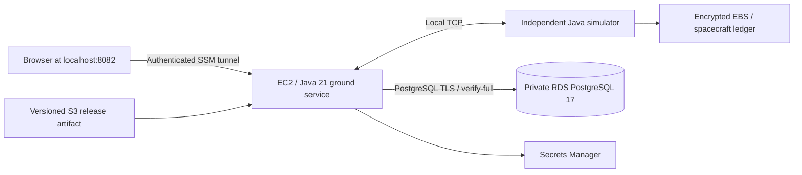

# Optional AWS deployment — prepared, not provisioned

These files are an optional deployment path. No AWS resources have been created as part of preparing them. CloudFormation validation and local tests do **not** establish that deployment has succeeded in an AWS account. Account policies, regional capacity, IAM permissions, package installation and SSM connectivity still require a real deployment check.

The existing Docker setup remains the local development environment. The cloud database starts empty and Flyway creates its schema; this setup does not upload local mission history or the local simulator ledger.

## Design



| Choice | Purpose and tradeoff |
| --- | --- |
| RDS PostgreSQL 17, `db.t4g.micro`, Single-AZ, 20 GiB gp3 | Preserves JDBC/Flyway and existing relational data. Seven-day automated backups; no multi-zone availability claim. |
| One `t3.small` EC2 host, Amazon Linux 2023, Java 21 | Runs the ground service and simulator as separate systemd processes. CPU credits use standard mode; sustained CPU can be throttled. |
| Private database subnets | No public database endpoint. Port 5432 accepts traffic only from the application security group. |
| EC2 public subnet, no inbound security-group rules | The host needs outbound HTTPS to SSM, S3, Secrets Manager and package repositories. A public IPv4 address avoids a NAT gateway, but has its own charge. This is not a fully private-subnet compute design. |
| Session Manager port forwarding | AWS authenticates access. The application and simulator listen on loopback. No SSH keys, open SSH port, domain, ALB, or internet-facing console. |
| Secrets Manager + Spring config tree | Passwords stay out of Git, template parameters, process arguments and unit files. A root helper writes the application password to a protected file in `/run` each time the ground service starts. |
| Separate `apogee_app` database role | Application owns its tables and can migrate in the public schema; it does not connect as the RDS administrator. The EC2 bootstrap role can read the administrator secret to initialize permissions. |
| Versioned S3 artifact + SHA-256 check | Publishes the same executable JAR as the local build, without compiling on a small cloud host. Deployments retain earlier artifacts. |

SSM access is for a trusted operator. It is not application-level authorization or a public recruiter demo. A public deployment needs its own login/authorization and HTTPS design. This stack creates no CloudWatch log agent; service logs are inspected through SSM with `journalctl`.

## Costs before deployment

Choose an AWS account, region and monthly budget first. Use the [AWS pricing calculator](https://calculator.aws/) with the exact resource sizes above. Include EC2 compute, its public IPv4 address, 16 GiB gp3 EBS, RDS compute and storage, snapshots, two secrets, S3 versions/requests and data transfer. Free-tier eligibility is account-specific. A budget alert is a notification, not a spending cap.

No NAT gateway, load balancer, Kubernetes cluster or Multi-AZ database is included. This does not make the stack free. [RDS pricing](https://aws.amazon.com/rds/postgresql/pricing/), [EC2 pricing](https://aws.amazon.com/ec2/pricing/on-demand/), [VPC IPv4 pricing](https://aws.amazon.com/vpc/pricing/).

## Check and package without an AWS account

Run from the repository root. JDK 21+, Node 22.12+ and Python 3.10+ are needed to build/package locally. `scripts/build.sh` uses the Maven wrapper.

```sh
python3 -m venv /tmp/apogee-aws-check
/tmp/apogee-aws-check/bin/pip install cfn-lint==1.50.0
/tmp/apogee-aws-check/bin/cfn-lint infra/aws/template.yaml
python3 -m unittest discover -s infra/aws/tests -v
bash -n infra/aws/runtime/install.sh
./scripts/build.sh
python3 scripts/aws.py package
python3 infra/aws/tests/check_database_tls.py  # Docker required; creates/removes its own test DB
```

Packaging makes no AWS calls. The archive contains the application JAR and runtime installation files, not environment files, local telemetry, credentials or database volumes. Running `python3 scripts/aws.py` with no subcommand only displays help.

The TLS integration check starts a disposable local PostgreSQL 17 container with a test certificate, initializes the application role using a non-superuser administrator, and starts the real JAR on a temporary port. It verifies Flyway startup, encrypted JDBC connections, the config-tree password taking precedence over the local fallback, restricted application-role privileges, and rejection of a mismatched server hostname. It does not connect to your local demo database or to AWS. GitHub Actions runs this check alongside the six offline deployment tests and CloudFormation validation.

## Later: review a stack, then create resources

Only run this section after deciding to incur AWS charges. Install the [AWS CLI v2](https://docs.aws.amazon.com/cli/latest/userguide/getting-started-install.html) and [Session Manager plugin](https://docs.aws.amazon.com/systems-manager/latest/userguide/session-manager-working-with-install-plugin.html). Sign in with temporary credentials such as IAM Identity Center (`aws configure sso`, then `aws sso login --profile YOUR_PROFILE`). Set `AWS_PROFILE` if using a named profile. Do not put account credentials in this repository.

The deployment identity needs CloudFormation and permissions to create the described VPC/EC2/RDS/S3/Secrets Manager/IAM resources, including `iam:PassRole`. Application publishing needs S3 upload and SSM Run Command permissions; opening the console needs Session Manager permissions. The template's host IAM role is separate from your operator identity. This setup targets standard commercial AWS regions with at least two availability zones; GovCloud/China are not validated.

Use `us-east-2` below only as an example; change it consistently for your selected region. Verify the account and available PostgreSQL 17 versions/classes:

```sh
aws sts get-caller-identity
aws rds describe-orderable-db-instance-options --region us-east-2 \
  --engine postgres --db-instance-class db.t4g.micro \
  --query 'OrderableDBInstanceOptions[].EngineVersion' --output text
```

Create an **unexecuted** change set for review. This command does not launch the resources:

```sh
aws cloudformation create-change-set --region us-east-2 \
  --stack-name apogee-demo --change-set-name initial-review --change-set-type CREATE \
  --template-body file://infra/aws/template.yaml --capabilities CAPABILITY_IAM
aws cloudformation wait change-set-create-complete --region us-east-2 \
  --stack-name apogee-demo --change-set-name initial-review
aws cloudformation describe-change-set --region us-east-2 \
  --stack-name apogee-demo --change-set-name initial-review
```

After reviewing resources, cost and account, this command **creates billable resources**:

```sh
aws cloudformation execute-change-set --region us-east-2 \
  --stack-name apogee-demo --change-set-name initial-review
aws cloudformation wait stack-create-complete --region us-east-2 --stack-name apogee-demo
```

CloudFormation completion means resources exist; application installation happens next. Wait until the EC2 instance appears as **Online** in Systems Manager. User data installs Corretto, the PostgreSQL client and AWS CLI. If this fails, inspect `/var/log/cloud-init-output.log` through SSM. There is no public SSH fallback.

## Publish the built application and open it

```sh
python3 scripts/aws.py publish --stack apogee-demo --region us-east-2
python3 scripts/aws.py tunnel --stack apogee-demo --region us-east-2
```

The publish command uploads a release, initializes the application database role, installs two systemd services and waits for fresh telemetry. Its SSM command ID is printed for troubleshooting. The tunnel opens the cloud app at **http://127.0.0.1:8082**, leaving the local Docker app on 8081. Browser-to-local-port traffic is loopback HTTP; the remote leg uses the authenticated SSM tunnel. The database connection verifies the RDS server certificate using the AWS CA bundle.

For an update, finish or resolve the active procedure, stop issuing commands, build the new JAR and run `publish` again. The installer rejects a currently active procedure when the existing ground service responds; this is an operator maintenance window, not an atomic deployment lock. Both Java services restart during updates. The ledger stays at `/var/lib/apogee/spacecraft.json`; a backend recovering unfinished work still requires reconciliation. Releases are content-addressed by JAR hash, so running JVMs are not handed an overwritten JAR.

Before calling the cloud version verified, exercise nominal execution, a lost acknowledgment, reconciliation, process restart and an RDS snapshot restore. The local `scripts/check-restart.py` targets Docker and must not be described as an AWS recovery test.

## Credentials, persistence and cleanup

- RDS manages/rotates the administrator secret. The application uses a separate generated secret with no automatic rotation schedule. To rotate it, coordinate changing that secret, initializing the database password and restarting the ground service during a maintenance window. Changing only the secret will break new connections.
- The root helper fetches the application secret at every ground-service startup. The runtime account reads only the protected config-tree file. The instance role can also retrieve the admin secret for deployment; trusted host access is therefore required.
- EC2 stop/start and process restarts preserve the EBS ledger. Host replacement requires manually restoring `/var/lib/apogee/spacecraft.json` from the retained volume before resuming old runs. There is no automatic cross-host ledger recovery.
- Deleting the stack snapshots RDS and retains the artifact bucket, application secret and EC2 root volume. These retained resources can keep incurring charges. Inventory, export required history/ledger state and deliberately remove retained resources after deciding they are no longer needed.
- Stopping RDS is temporary: AWS automatically restarts it after seven days, and storage/backup charges continue while stopped. See [RDS stop behavior](https://docs.aws.amazon.com/AmazonRDS/latest/UserGuide/USER_StopInstance.html). Stopping EC2 also leaves EBS charges. Stopping services is not complete cost cleanup.
- This is a single-instance portfolio deployment. It does not add high availability, an independently replicated simulator ledger, public user authentication or automatic disaster recovery.

References: [RDS CloudFormation resource](https://docs.aws.amazon.com/AWSCloudFormation/latest/TemplateReference/aws-resource-rds-dbinstance.html), [RDS verified TLS](https://docs.aws.amazon.com/AmazonRDS/latest/UserGuide/PostgreSQL.Concepts.General.SSL.html), [Session Manager](https://docs.aws.amazon.com/AWSEC2/latest/UserGuide/connect-with-systems-manager-session-manager.html), [Corretto 21 on Amazon Linux](https://docs.aws.amazon.com/corretto/latest/corretto-21-ug/amazon-linux-install.html).
